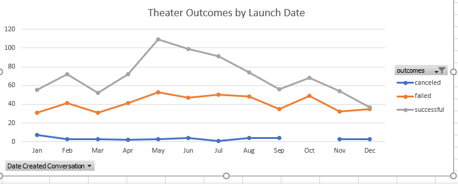

# Kickstarting-Challenge

## Overview of Project

### Background
Louise is an up and coming playwright wants to start a Kickstarting campaing so she it helps her to fund her play "Fever", she is expecting a budget of over $10,000 dollars so she is turning to us, Excels power users,
to help and set her up for success. 

### Purpose 
The purpose of this challenge is to use Excel to Organize, sort, and analyze crowdfunding data to determine wheter there are specific factors that make a project's campaign successful. Analyzing current side data, We will
help her to gain a greater understanding on how her campaing can be succesful. There are 2 Analyses that are required to help her:
	
	-Theather outcomes based on launch date
	-Ooutcomes Based on Goals   

## Analysis and Challenges:

### Analysis of Outcomes Based on Launch Date
The purpose of this analaysis is to see if seasonality affects the outcome of a campaing. We created a new Column called "year" in ([Kickstarter_Challenge.xlsx](/Kickstarter_Challenge.xlsx) so we could Analyse if the Launch date had any affect on the outcome, then we moved on to filter the data in such a way the outcome results showed beside every month. If we Analayze the data we could get a success rate by dividing the succesful outcomes by the total outcomes for every month, when doing this we can see that May has the highest rate. However, why create more equations when we can analyze the graph below, we could see that there is a spike in May for campaings to succeed, therefore May is the best month to start a campaing.

### Analysis of Outcomes Based on Goals
The main point from this analysis was to obtain visualization on the outcome percentage based on the funding goals for each campaing. To get a result we had to collect data create ranges of goal amounts and then see the number of outcomes according to each range. We were required to use CountIfs and being able to allocate the right data to the right equations. We creted a line graph that showed the ranges and their outcome percentages in order to have better visualization.

 
### Challenges and Difficulties Encountered

## Results

- What are two conclusions you can draw about the Outcomes based on Launch Date?
- If we Analayze the data we could get a success rate by dividing the succesful outcomes by the total outcomes for every month, when doing this we can see that May has the highest rate. However, why create more equations when we can analyze the graph below, we could see that there is a spike in May for campaings to succeed, therefore May is the best month to start a campaing. and the worst time to starts a campaing would be December

- What can you conclude about the Outcomes based on Goals?

- What are some limitations of this dataset?

- What are some other possible tables and/or graphs that we could create?
